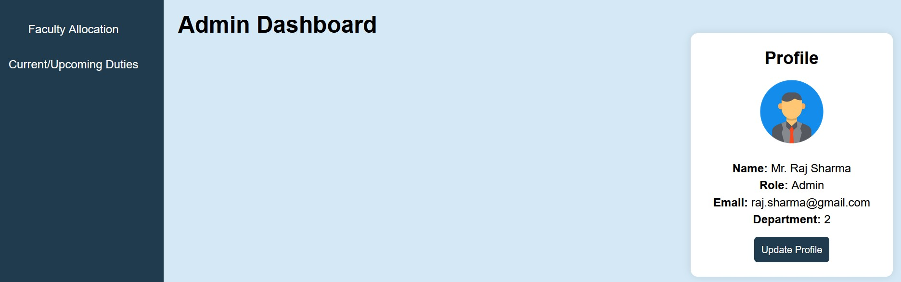
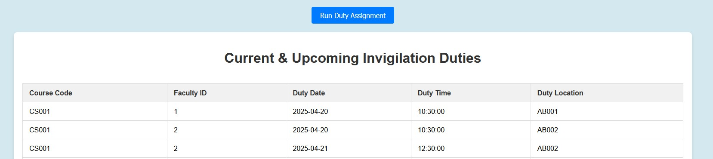

# Examination Invigilation Management System

A web-based examination invigilation and duty allocation system developed as a second-year group project.

The system was designed to help manage:
- Faculty records
- Building and classroom allocation
- Examination scheduling
- Invigilation duty assignment
- Duty viewing through dashboards

## Technologies Used

- Python
- Flask
- MySQL
- HTML
- CSS
- JavaScript

## Features

- Faculty management system
- Building and classroom allocation
- CRUD APIs using Flask
- Automated invigilation duty assignment
- Dynamic dashboard views
- Stored procedures for duty allocation and overlap handling

## Project Structure

```text
static/      -> CSS, JavaScript, assets
templates/   -> HTML templates
app.py       -> Flask backend and APIs
```

## Project Screenshots  
Login Screen  
  

Admin Dashboard  
  

Duty Assignment  

